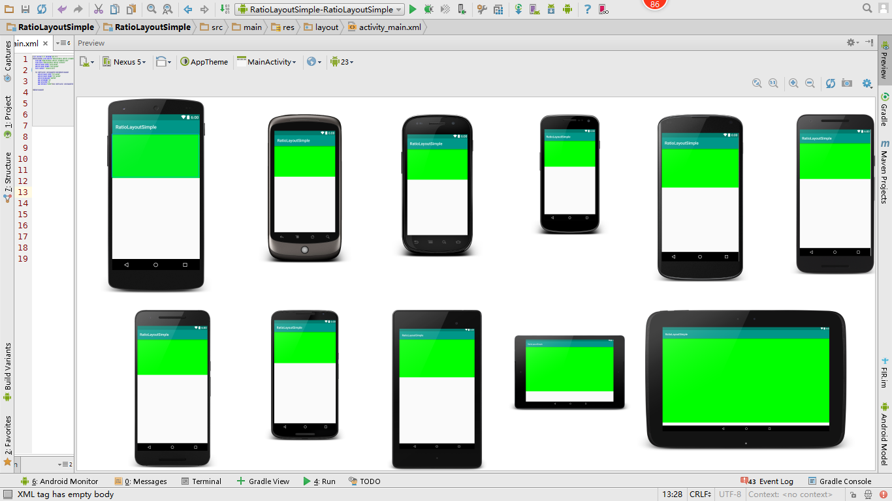
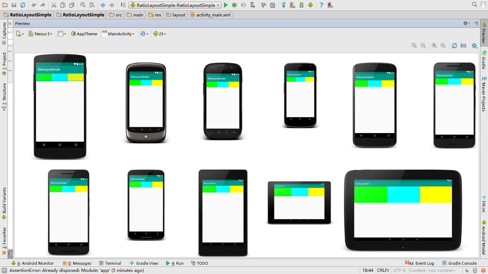

# RatioLayout
RatioLayout 按比例布局，适配屏幕
#####还在为UI只标注IOS 的尺寸而犯愁？
#####讲道理？   和女孩子讲道理，你疯了？ 男的？要不你试试打一顿
#####靠眼力？别开玩笑了，你那电脑屏幕，眼睛会瞎的
#####还在为不同的屏幕 写几套尺寸？ 省省吧，哪有那么浪费时间的

上图<p/>
<br>
<br>

因为经常用到Relative,所以先重写 RelativeLayout

后来因为Material Design的水波效果又加上了FrameLayout

使用方法：
```xml
    <cn.modificactor.ratiolayout.RatioRelativeLayout
        android:layout_width="fill_parent"
        android:layout_height="fill_parent"
        android:background="#00ff00"
        app:ratioHeight="10"
        app:ratioWidth="20"
        app:reference="width|height" />
```
首先呢，你需要，自己确定高或者宽的具体尺寸（- - 在努力）
然后呢app:reference 这个填入之前确定尺寸的是高还是宽
app:ratioHeight
app:ratioWidth
这两个呢，就是宽高比了，直接填入IOS的尺寸也是可以的呀:)

要有别的？
构造方法填入
```java
        TypedArray typedArray = context.obtainStyledAttributes(attrs, R.styleable.RatioRelativeLayout, defStyleAttr, 0);
        //获取参考边
        reference = typedArray.getInt(R.styleable.RatioRelativeLayout_reference, 0) == 0 ? ReferenceType.WIDTH : ReferenceType.HEIGHT;
        //获取高比例
        ratioHeight = typedArray.getFloat(R.styleable.RatioRelativeLayout_ratioHeight, 1);
        //获取宽比例
        ratioWidth = typedArray.getFloat(R.styleable.RatioRelativeLayout_ratioWidth, 1);
        typedArray.recycle();
```
外面填入
```java
    /**
     * 以哪边为参考，默认为宽
     */
    ReferenceType reference = ReferenceType.WIDTH;
    /**
     * 宽的比例
     */
    double ratioWidth = 1;
    /**
     * 高的比例
     */
    double ratioHeight = 1;

    @Override
    protected void onMeasure(int widthMeasureSpec, int heightMeasureSpec) {
        /**
         * 如果以宽慰基准边则宽不变，高按比例得出具体数值，反之亦然
         */
        setMeasuredDimension(View.getDefaultSize(0, reference == ReferenceType.WIDTH ? widthMeasureSpec :
                        (int) (heightMeasureSpec / ratioHeight * ratioWidth)),
                View.getDefaultSize(0, reference == ReferenceType.HEIGHT ? heightMeasureSpec :
                        (int) (widthMeasureSpec / ratioWidth * ratioHeight)));

        int childSpec = reference == ReferenceType.WIDTH ? getMeasuredWidth() : getMeasuredHeight();
        /**
         * 获取非基准边的尺寸
         */
        int measureSpec = reference == ReferenceType.HEIGHT ? MeasureSpec.makeMeasureSpec(
                (int) (childSpec / ratioHeight * ratioWidth), MeasureSpec.EXACTLY) :
                MeasureSpec.makeMeasureSpec(
                        (int) (childSpec / ratioWidth * ratioHeight), MeasureSpec.EXACTLY);

        super.onMeasure(reference == ReferenceType.WIDTH ? widthMeasureSpec : measureSpec, reference == ReferenceType.HEIGHT ? heightMeasureSpec : measureSpec);
    }
```


就可以了，适用View&ViewGroup
